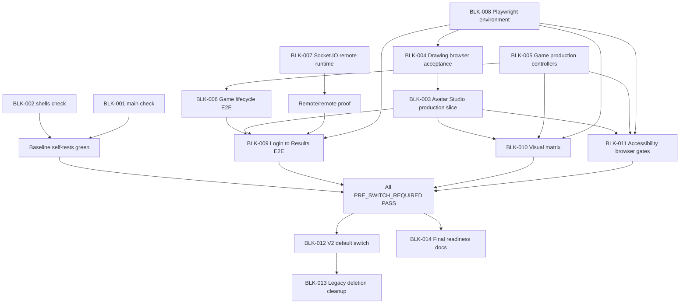

# 04 Legacy Removal Remediation Plan

Date: 2026-07-14

Scope: documentation-only audit. No runtime code, package script, dependency, Phaser, legacy UI, placeholder, or check implementation was changed.

Conclusion: **legacy removal readiness remains FAIL**. The current failures are not one single removal task. They split into pre-switch parity gaps, the eventual default-entry switch, post-switch cleanup, and environment blockers for Playwright/browser proof.

## Source Handling

Source priority used:

1. `docs/frontend-v2/decisions/product-decisions.md`
2. `docs/frontend-v2/contracts/screen-state-matrix.md`
3. `docs/frontend-v2/contracts/migration-gates.md`
4. `docs/frontend-v2/decisions/drawing-engine-adr.md`
5. `docs/frontend-v2/reports/03-legacy-removal-readiness.md`
6. `docs/frontend-v2/reports/03-final-parity-matrix.md`
7. `docs/frontend-v2/FINAL_PLAN.md`
8. Runtime files and tests inspected only as current implementation evidence

`FINAL_PLAN.md` does not override newer Drawing Engine, fallback, data-mode, realtime, or migration gate documents.

`AGENTS.md` handling:

- The prompt-provided `AGENTS.md` instructions were applied.
- No root `AGENTS.md` file exists in this checkout.
- `client/src/game/AGENTS.md` was read for Phaser/game preservation rules. It forbids changing Phaser rendering, physics, collision, game timing, map rules, freeze/overtime/ranking, and allows only React wrapper, lifecycle, resize, typed bridge event, and accessibility work around the canvas.

Commands run for this audit:

| Command | Result |
| --- | --- |
| `npm run main:check --workspace client` | FAIL |
| `npm run shells:check --workspace client` | FAIL |

## Readiness Summary

| Area | Current status | Removal readiness |
| --- | --- | --- |
| `main:check` | Fails on stale AppV2 Lobby placeholder assertion | FAIL |
| `shells:check` | Fails on StudioShell grid contract mismatch | FAIL |
| Avatar Studio | Route still renders placeholder; no production screen/controller/adapter | FAIL |
| Game S4/D/M/E/F | Fixture/bridge preview only; no production game phase controller path | FAIL |
| E2E | Lobby/room partial; no Login to Results full flow | FAIL |
| Visual | Launcher State Gallery evidence only; Studio/Game missing | FAIL |
| Accessibility | Static checks only; no browser keyboard/focus/canvas conflict proof | FAIL |
| Remote/remote | Socket.IO adapter shape exists, but no installed runtime client or approved injection proof | FAIL |
| Environment | Playwright blocked in previous report by watcher limit and missing browser library | BLOCKED |

## 1. `main:check`

### Actual Script

Defined in `client/package.json`:

```bash
node tests/main-settings-screen.test.mjs && node tests/main-settings-controller.test.mjs
```

### What It Checks

`tests/main-settings-screen.test.mjs` checks the Main and Settings presentational screen contract: required states, visible Korean copy, shell/component usage, modal registration, and presentational boundaries.

`tests/main-settings-controller.test.mjs` checks controller behavior and integration:

- navigation callbacks to lobby, asset studio, and warehouse;
- settings persistence;
- nickname validation;
- invalid and expired device-code states;
- remote error without mock fallback;
- boot loading of asset/session/device ports;
- static port boundaries and route integration in `AppV2`.

### Current Failure Output

Command:

```bash
npm run main:check --workspace client
```

Relevant output:

```text
main/settings screen contract self-test passed
AssertionError [ERR_ASSERTION]: The input did not match /S3 Lobby placeholder/.
```

Failing assertion:

- `client/tests/main-settings-controller.test.mjs`
- Assertion: `assert.match(appSource, /S3 Lobby placeholder/)`

Current implementation evidence:

- `client/src/app/AppV2.tsx` routes `case 'lobby'` to `<LobbyController />`.
- The old placeholder string is no longer present in `AppV2`.

### Judgment

| Question | Judgment |
| --- | --- |
| Must pass before switch? | Yes. It is a V2 parity self-test, not a post-switch-only test. |
| Only passable after V2 default switch? | No. It targets `AppV2` and `/ui-v2.html`, so it should pass before `main.tsx` changes. |
| Sequencing failure or structural defect? | Sequencing failure in the test contract. Lobby moved beyond placeholder, but `main:check` still expects the old placeholder string. |
| Does it prove Main/Settings are broken? | No. The screen suite passes before the stale AppV2 assertion. |
| Does it block readiness? | Yes. A required check is red and must be made green without weakening coverage. |

### Non-Weakening Fix Path

Do not reintroduce `S3 Lobby placeholder`. Replace the stale assertion with stronger coverage that verifies the current target state:

- `case 'lobby':` exists in `AppV2`;
- `AppV2` renders `<LobbyController />` for the lobby route;
- `prototypeRouter` maps `/lobby` to `{ kind: 'lobby', screenId: 'S3_LOBBY' }`;
- `main` navigation callback still calls `setPrototypeRoute('lobby')`;
- package script command stays unchanged.

## 2. `shells:check`

### Actual Script

Defined in `client/package.json`:

```bash
node tests/shell-components.test.mjs
```

### What It Checks

`tests/shell-components.test.mjs` checks the shell component contract:

- `LauncherShell`, `StudioShell`, and `GameShell` source and CSS files exist;
- each shell exposes `data-v2-component`;
- Launcher has `data-v2-shell="launcher"`, modal/toast/nav layers, gradient, tile grid, title surface, and content panel tokens;
- Studio has `data-v2-shell="studio"`, left/right panel state attributes, collapsed/resizing states, center minimum width, and the canonical 280/520/320 grid structure;
- Game has `data-v2-shell="game"`, canvas/HUD/shelf/dock/overlay slots, 220/720/160 grid structure, and canvas priority z-index;
- UI Lab includes all viewport presets and shell states;
- shell files have no raw hex/rgb usage or forbidden runtime imports.

### Current Failure Output

Command:

```bash
npm run shells:check --workspace client
```

Relevant output:

```text
AssertionError [ERR_ASSERTION]: The input did not match
/grid-template-columns: minmax\(var\(--spacing-16\), 280px\) minmax\(520px, 1fr\) minmax\(var\(--spacing-16\), 320px\)/
```

Failing file and symbol:

- File: `client/src/design-system/shells/StudioShell/StudioShell.module.css`
- Symbol: `.workspace`

Current implementation:

```css
grid-template-columns:
  minmax(var(--spacing-16), var(--studio-left-panel-width, 280px))
  minmax(520px, 1fr)
  minmax(var(--spacing-16), var(--studio-right-panel-width, 320px));
```

Expected contract:

```css
grid-template-columns: minmax(var(--spacing-16), 280px) minmax(520px, 1fr) minmax(var(--spacing-16), 320px)
```

### Judgment

| Question | Judgment |
| --- | --- |
| Must pass before switch? | Yes. Shell contracts are foundation-level V2 UI readiness. |
| Only passable after V2 default switch? | No. Shells are independent of `main.tsx`. |
| Sequencing failure or structural defect? | Structural contract mismatch between StudioShell CSS and the current shell self-test. |
| Failed file/symbol | `StudioShell.module.css` `.workspace` grid. |
| Test expectation | Fixed default Studio grid: left `280px`, center `minmax(520px, 1fr)`, right `320px`. |

### Non-Weakening Fix Path

Do not weaken or delete the shell assertion. Align the StudioShell default grid with the current contract as the active default declaration:

- restore the canonical fixed default grid for `.workspace`;
- keep collapsed/resizing visual states;
- if resizable panel widths are still required, add them in a separate accepted contract update with tests that explicitly prove default, collapsed, resizing, and resized states;
- do not hide the mismatch by changing only the test regex.

## 3. Avatar Studio

### Current Route and Placeholder

`client/src/app/AppV2.tsx`:

- `case 'avatarStudio'` renders `ScreenPlaceholder`;
- title is `A Avatar Studio placeholder`;
- route state exposes `screenId`, `mode`, and `sourceAssetId`, but no production screen is mounted.

### Drawing Engine Status

`docs/frontend-v2/decisions/drawing-engine-adr.md` status:

```text
PROVISIONALLY_ACCEPTED technical recommendation for Phase 2C planning.
Browser acceptance must pass in CI before this ADR can be marked ACCEPTED.
Runtime integration is still PLANNED.
```

Implementation evidence:

- Drawing Engine experiment code exists under `client/src/experiments/drawing-engine/**`.
- Asset Studio has `client/src/infrastructure/asset-studio/assetStudioDrawingPort.ts`, which imports the experiment core and browser canvas adapter.
- No `client/src/pages/avatar-studio/AvatarStudioScreen.tsx`, Avatar Studio controller, avatar drawing adapter, or avatar submission slice exists.

### Production Connection State

| Contract item | Current state |
| --- | --- |
| AvatarStudioScreen View | Missing |
| AvatarStudioController/use hook | Missing |
| DrawingEngine production adapter for avatar | Missing |
| AssetPort avatar submission | Missing |
| My avatars load/edit/remix | Missing |
| Submit success to main | Missing |
| Paste/drop blocking on final UI | Missing |
| Exact PNG 256x512 from 768x1536 workspace | Not proven in production UI |
| Browser acceptance | Blocked/not PASS in previous report |
| Tests | No Avatar Studio check script or E2E |

### Judgment

Avatar Studio is a `PRE_SWITCH_REQUIRED` blocker. The route being reachable is not enough for legacy removal because the product screen is still a placeholder and Drawing Engine acceptance is not final.

## 4. Game S4 / D / M / E / F

Current route handling:

- `client/src/app/AppV2.tsx` routes `mapBuild`, `validation`, `merging`, `race`, and `results` to `GamePhaseController`.
- `GamePhaseController` resolves fixtures with `resolveFixtureForRoute` and renders `GameFixturePreview`.
- Phaser bridge wrappers exist for Map Editor, Playtest, and Race canvases.
- `game:check` validates bridge/static contracts only. It does not prove production game progression.

### Route Capability Matrix

| Route | fixture-only | bridge-preview | production controller connected | Phaser connected | actual route reachable | lifecycle validated | submit/phase transition connected | E2E covered |
| --- | --- | --- | --- | --- | --- | --- | --- | --- |
| MapBuild S4 | Yes | Yes, `MapEditorPhaserBridge` and build-test `PlaytestPhaserBridge` | No | Yes | Yes, `/ui-v2.html#/map-build` | Static bridge cleanup/resize/duplicate checks only | No. Submit and time vote only update local fixture state/message | No |
| Validation D | Yes | Yes, `PlaytestPhaserBridge` | No | Yes | Yes, `/ui-v2.html#/validation` | Static bridge checks only | No. Clear/failure only update local fixture state/message | No |
| Merging M | Yes | No Phaser bridge required in current fixture | No | Not applicable | Yes, `/ui-v2.html#/merging` | Not applicable | No. Retry only updates local fixture state/message | No |
| Race E | Yes | Yes, `RacePhaserBridge` | No | Yes | Yes, `/ui-v2.html#/race` | Static bridge checks only | No. Progress/finish only update local message or route to fixture Results | No |
| Results F | Yes | No | No | Not applicable | Yes, `/ui-v2.html#/results` | Not applicable | No final production result record/leave flow proof | No |

### Judgment

Game S4/D/M/E/F is a `PRE_SWITCH_REQUIRED` blocker. The current work is a valuable bridge preview, but it does not replace the legacy game flow because production ports, phase transitions, realtime sync, and E2E proof are absent.

## 5. E2E

Existing browser-level tests:

| Config | Spec | Scope |
| --- | --- | --- |
| `client/playwright.launcher.config.ts` | `tests/visual/launcher-screenshots.spec.ts` | Launcher State Gallery evidence screenshots only |
| `client/playwright.lobby-room.config.ts` | `tests/lobby-room/lobby-room-contexts.spec.ts` | Two browser contexts for lobby/room create/join/ready/leave/reconnecting fixture |
| `client/playwright.drawing.config.ts` | `tests/drawing-engine/browser.spec.ts` | Drawing Engine browser harness, not Avatar Studio production UI |

Coverage judgment:

- Existing E2E does not cover a real Login to Results V2 user flow.
- Launcher visual spec uses State Gallery fixture URLs, not controller-connected product flow.
- Lobby/room spec is the only actual multi-context V2 flow, and it stops before S4 Map Build.
- Drawing browser spec validates a harness, not the final Avatar Studio or Asset Studio UI.
- No remote/remote browser flow is proven.

Missing Login to Results chain:

1. Login/session boot and valid token restore.
2. Main CTAs and settings persistence in browser.
3. Warehouse avatar/component actions.
4. Avatar Studio production submit.
5. Asset Studio production submit.
6. Lobby create/join/ready/start.
7. Map Build submit.
8. Validation clear/failure record.
9. Merging progress/final merged map.
10. Race progress/finish.
11. Results final ranking and leave.

Mode coverage:

| Mode | Current browser proof |
| --- | --- |
| `VITE_DATA_MODE=mock`, `VITE_REALTIME_MODE=local` | Partial. Lobby/room only, blocked in prior environment report. |
| `VITE_DATA_MODE=remote`, `VITE_REALTIME_MODE=remote` | Not proven. Socket.IO runtime dependency or approved factory injection is missing. |

## 6. Visual

Current screenshot coverage:

- Viewports present in launcher screenshot spec: `1280x720`, `1440x900`, `1920x1080`.
- Coverage is Launcher State Gallery cases only.
- Evidence screenshots are written by Playwright with `page.screenshot`.
- Config sets `screenshot: 'off'`; the spec intentionally writes evidence files and does not auto-update golden snapshots.

Missing screenshot coverage:

- StudioShell, Avatar Studio, Asset Studio production states.
- GameShell and S4/D/M/E/F states.
- Full controller-connected screens beyond Launcher State Gallery fixtures.
- Error/offline/reconnecting states across Studio/Game.
- Final baseline/golden approval policy after evidence is reviewed.

Visual readiness is `PRE_SWITCH_REQUIRED`, but current execution is also `ENVIRONMENT_BLOCKED` until Playwright can run in the pinned CI/browser environment.

## 7. Accessibility

Current automated coverage:

- Static component checks for primitive/core components, modal focus behavior, icon button API, ARIA labels, aria-live, role usage, and focus-visible CSS.
- Static launcher visual/a11y checks.
- Static game bridge checks for timer/status/aria-live.

Missing critical coverage:

- No browser-level axe or equivalent accessibility scan is configured.
- No keyboard-only full-flow E2E.
- No browser proof for route focus management.
- No browser proof for modal focus trap/restore across Launcher, Warehouse, Settings, and Game build-test modal.
- No browser proof for aria-live timing in controller-connected async states.
- No full-app icon-only button accessible-name audit.
- No Game canvas/UI focus-conflict test, especially with Phaser input and surrounding React controls.

Accessibility readiness is `PRE_SWITCH_REQUIRED`, with browser execution partially `ENVIRONMENT_BLOCKED`.

## Blocker Register

### BLK-001: `main:check` stale Lobby placeholder assertion

- Classification: `PRE_SWITCH_REQUIRED`
- Current status: `main-settings-screen` passes, then `main-settings-controller` fails on `/S3 Lobby placeholder/`.
- Evidence files: `client/tests/main-settings-controller.test.mjs`, `client/src/app/AppV2.tsx`, `client/src/app/navigation/prototypeRouter.ts`.
- Failed command: `npm run main:check --workspace client`.
- Root cause: Lobby is now routed to `<LobbyController />`, but the controller self-test still expects the old S3 placeholder string.
- Fix path: replace the stale placeholder assertion with stronger checks for `LobbyController` route integration and `S3_LOBBY` route model. Keep the package script unchanged.
- Fix forbidden path: do not reintroduce a placeholder, do not delete the assertion without replacement, do not edit `main.tsx`.
- Acceptance criteria: `main:check` passes; Main navigation still reaches Lobby; `AppV2` renders `LobbyController`; no mock fallback appears in remote Main/Settings ports.
- Required tests: `npm run main:check --workspace client`, `npm run lobby-room:check --workspace client`.
- Expected commit unit: `test(main): align main route contract with LobbyController`.
- Predecessors: none.

### BLK-002: `shells:check` StudioShell grid contract mismatch

- Classification: `PRE_SWITCH_REQUIRED`
- Current status: `shells:check` fails on the StudioShell `.workspace` grid assertion.
- Evidence files: `client/tests/shell-components.test.mjs`, `client/src/design-system/shells/StudioShell/StudioShell.module.css`.
- Failed command: `npm run shells:check --workspace client`.
- Root cause: CSS uses custom panel width variables where the current shell contract expects the fixed default 280/520/320 grid.
- Fix path: restore the canonical fixed default grid as the active StudioShell default and keep collapsed/resizing visual states. If resizable widths remain a requirement, add a later explicit contract/test for resized state.
- Fix forbidden path: do not weaken the regex, do not hide the mismatch with a test-only fixture, do not remove StudioShell resizing state attributes.
- Acceptance criteria: `shells:check` passes; StudioShell still exposes left/right state attributes; 1280/1440/1920 UI Lab shell previews remain present.
- Required tests: `npm run shells:check --workspace client`, `npm run lint --workspace client -- --quiet`.
- Expected commit unit: `fix(shell): restore StudioShell default grid contract`.
- Predecessors: none.

### BLK-003: Avatar Studio route is still placeholder

- Classification: `PRE_SWITCH_REQUIRED`
- Current status: `/ui-v2.html#/avatar-studio` is reachable but renders `A Avatar Studio placeholder`.
- Evidence files: `client/src/app/AppV2.tsx`, `client/src/app/navigation/prototypeRouter.ts`.
- Failed command: none specific today; reported as FAIL in `03-final-parity-matrix.md`.
- Root cause: Avatar Studio View, Controller, DrawingEngine adapter, and AssetPort connection are not implemented.
- Fix path: implement AvatarStudioScreen as a pure View, AvatarStudioController, production Drawing Engine adapter for avatar dimensions, AssetPort avatar submission, fixtures, State Gallery, and tests.
- Fix forbidden path: do not connect production Drawing Engine before browser acceptance is PASS; do not import ports into the View; do not change Phaser; do not reuse legacy UI visuals.
- Acceptance criteria: Avatar Studio route renders production V2 screen; visible canvas is 256x512; workspace is 768x1536; exact PNG export is 256x512; submit success routes to Main; unchanged loaded source blocks submit.
- Required tests: Avatar Studio unit/controller tests, drawing browser tests, screenshot tests, accessibility focus/keyboard tests.
- Expected commit unit: `feat(avatar-studio): production vertical slice`.
- Predecessors: BLK-004.

### BLK-004: Drawing Engine ADR is not ACCEPTED in browser

- Classification: `PRE_SWITCH_REQUIRED`, partially `ENVIRONMENT_BLOCKED`
- Current status: ADR is `PROVISIONALLY_ACCEPTED`; runtime integration is `PLANNED`.
- Evidence files: `docs/frontend-v2/decisions/drawing-engine-adr.md`, `client/src/experiments/drawing-engine/**`, `client/playwright.drawing.config.ts`.
- Failed command: prior report says `npm run test:drawing-browser --workspace client` is blocked by missing Chromium system library.
- Root cause: core experiment exists, but browser acceptance for PNG encode/decode, pointer lifecycle, paste/drop blocking, overlays, screenshot/canvas-pixel checks is not PASS in CI.
- Fix path: repair Playwright environment, finish browser acceptance, then mark ADR `ACCEPTED` only after evidence passes.
- Fix forbidden path: do not mark ADR accepted based on Node/core tests only; do not connect production Avatar Studio to an unaccepted engine.
- Acceptance criteria: drawing browser suite PASS in pinned CI; ADR status updated through normal decision process; production adapter integration unblocked.
- Required tests: `npm run test:drawing-browser --workspace client`, core drawing tests, visual/canvas-pixel checks.
- Expected commit unit: `test(drawing): browser acceptance evidence`.
- Predecessors: BLK-008.

### BLK-005: Game phase screens are fixture/bridge preview only

- Classification: `PRE_SWITCH_REQUIRED`
- Current status: S4/D/M/E/F routes render `GamePhaseController`, but controller resolves fixtures and local state only.
- Evidence files: `client/src/pages/game/GamePhaseController.tsx`, `client/src/pages/game/GameScreens.tsx`, `client/src/fixtures/game/gameFixtures.ts`.
- Failed command: none today; `game:check` passes because it only checks bridge/static contract.
- Root cause: no production room/game use case or port integration exists for map submit, validation, merge, race progress, finish, or results finalization.
- Fix path: implement production controller paths behind the existing pure Views and typed Phaser Bridge. Add RoomPort/GameRealtime/GamePort integration according to screen-state-matrix.
- Fix forbidden path: do not edit Phaser physics/collision/gameplay rules; do not import API/realtime/storage into presentational screens; do not remove fixture gallery.
- Acceptance criteria: S4/D/M/E/F routes are production-controller connected in mock/local mode while preserving existing Phaser canvases.
- Required tests: game controller tests for submit/phase/progress/results; bridge lifecycle tests; route tests.
- Expected commit unit: `feat(game): connect production phase controllers`.
- Predecessors: BLK-002, BLK-007 for remote proof.

### BLK-006: Game lifecycle and phase transition E2E are missing

- Classification: `PRE_SWITCH_REQUIRED`
- Current status: bridge lifecycle has static checks, but no browser E2E proves mount/unmount/route leave/return/resize/listener cleanup/duplicate prevention across real routes.
- Evidence files: `client/src/pages/game/PhaserBridge.tsx`, `client/tests/game-shell-bridge.test.mjs`.
- Failed command: no dedicated failing command exists because coverage is missing.
- Root cause: current tests assert source patterns, not runtime browser lifecycle or multi-phase progression.
- Fix path: add Playwright game flow tests after production controllers exist.
- Fix forbidden path: do not satisfy this by only extending fixture screenshots; do not change Phaser internals.
- Acceptance criteria: browser test proves S4 to Results flow, route leave/return, resize, cleanup, and no duplicate Phaser game instance.
- Required tests: new game Playwright config/spec or integrated full-flow spec.
- Expected commit unit: `test(game): browser lifecycle and phase transition e2e`.
- Predecessors: BLK-005, BLK-008.

### BLK-007: Remote/remote Socket.IO runtime is not production-proven

- Classification: `PRE_SWITCH_REQUIRED`
- Current status: Socket.IO adapter shape exists, but `socket.io-client` is not installed and default remote transport reports `SOCKET_IO_CLIENT_MISSING` unless a factory is injected.
- Evidence files: `client/package.json`, `client/src/infrastructure/realtime/socketIoTransport.ts`, `client/src/infrastructure/realtime/realtimeAdapters.ts`, `client/tests/realtime-adapters.test.mjs`.
- Failed command: no failure today; `realtime:check` intentionally verifies missing dependency error.
- Root cause: product decision requires Socket.IO remote mode with no BroadcastChannel fallback, but runtime client dependency or approved production injection plan is absent.
- Fix path: either approve and install `socket.io-client` with dependency impact report, or provide an approved production socket factory injection path. Then run remote/remote E2E.
- Fix forbidden path: do not silently fall back to BroadcastChannel/local; do not expose socket events to Views; do not add dependency without approval report.
- Acceptance criteria: `VITE_REALTIME_MODE=remote` connects to backend Socket.IO; connection statuses map to connecting/connected/reconnecting/offline/error; no local fallback; remote/remote E2E passes.
- Required tests: `npm run realtime:check --workspace client`, remote/remote lobby-room/game E2E.
- Expected commit unit: `feat(realtime): production Socket.IO runtime adapter`.
- Predecessors: backend/socket environment available.

### BLK-008: Playwright environment is blocked

- Classification: `ENVIRONMENT_BLOCKED`
- Current status: previous reports record `ENOSPC` file watcher failure for launcher screenshots and missing `libatk-1.0.so.0` for Chromium launch.
- Evidence files: `docs/frontend-v2/reports/03-final-parity-matrix.md`, `docs/frontend-v2/reports/03-legacy-removal-readiness.md`, Playwright configs.
- Failed command: prior report lists `test:launcher-screenshots`, `test:lobby-room`, and `test:drawing-browser` as FAIL/BLOCKED.
- Root cause: pinned browser/CI system dependencies and watcher limits are not ready.
- Fix path: define CI/browser image requirements, install required system libraries, raise watcher limit or run in CI mode that does not hit local watcher constraints, and rerun all browser suites.
- Fix forbidden path: do not skip Playwright gates; do not approve legacy removal based only on static tests.
- Acceptance criteria: all Playwright configs run in pinned environment and produce evidence/report artifacts.
- Required tests: `npm run test:launcher-screenshots --workspace client`, `npm run test:lobby-room --workspace client`, `npm run test:drawing-browser --workspace client`, future game/accessibility specs.
- Expected commit unit: `ci(playwright): pinned browser environment`.
- Predecessors: none.

### BLK-009: Full Login to Results E2E is absent

- Classification: `PRE_SWITCH_REQUIRED`
- Current status: no browser test covers the actual V2 user flow from Login through Results.
- Evidence files: `client/tests/lobby-room/lobby-room-contexts.spec.ts`, `client/tests/visual/launcher-screenshots.spec.ts`, Playwright configs.
- Failed command: no dedicated command exists because the test is missing.
- Root cause: implemented tests are split between State Gallery, lobby/room partial E2E, and drawing harness; no end-to-end product flow exists.
- Fix path: add full-flow Playwright tests for mock/local first, then remote/remote once BLK-007 is solved.
- Fix forbidden path: do not claim State Gallery fixture coverage as product flow coverage.
- Acceptance criteria: Login -> Main -> Lobby/Room -> S4 -> D -> M -> E -> F passes in mock/local and remote/remote as applicable.
- Required tests: new full-flow Playwright spec, existing unit/controller checks.
- Expected commit unit: `test(e2e): v2 login-to-results flow`.
- Predecessors: BLK-003, BLK-005, BLK-006, BLK-007, BLK-008.

### BLK-010: Visual screenshot coverage is incomplete

- Classification: `PRE_SWITCH_REQUIRED`
- Current status: only Launcher State Gallery evidence matrix covers 1280x720, 1440x900, and 1920x1080.
- Evidence files: `client/tests/visual/launcher-screenshots.spec.ts`, `client/playwright.launcher.config.ts`.
- Failed command: prior report says launcher screenshot execution is environment-blocked.
- Root cause: Studio/Game visual matrices and production screen screenshots are missing.
- Fix path: extend screenshot coverage to StudioShell, Avatar Studio, Asset Studio, GameShell, S4/D/M/E/F, and required states. Keep evidence-first policy until golden baseline is approved.
- Fix forbidden path: do not auto-update snapshots without approved baseline; do not use only fixture URLs for production-controller readiness.
- Acceptance criteria: screenshots/evidence exist and pass for all required V2 screens/states at 1280x720, 1440x900, and 1920x1080.
- Required tests: launcher screenshots plus future studio/game visual specs.
- Expected commit unit: `test(visual): complete v2 screenshot matrix`.
- Predecessors: BLK-003, BLK-005, BLK-008.

### BLK-011: Accessibility browser coverage is incomplete

- Classification: `PRE_SWITCH_REQUIRED`
- Current status: static checks exist, but browser keyboard/focus/a11y coverage is missing.
- Evidence files: `client/tests/primitives.test.mjs`, `client/tests/core-components.test.mjs`, `client/tests/launcher-visual-audit.test.mjs`, `client/tests/game-shell-bridge.test.mjs`.
- Failed command: no dedicated failing command exists because coverage is missing.
- Root cause: no browser-level accessibility test suite covers focus, keyboard-only operation, modal focus restore, aria-live behavior, icon names, and Game canvas focus conflicts.
- Fix path: add browser accessibility tests after production screens are present. Include keyboard-only navigation and canvas/React focus boundary tests.
- Fix forbidden path: do not treat static source assertions as full accessibility approval; do not bypass Game canvas focus checks.
- Acceptance criteria: no critical accessibility issue remains; keyboard-only flow reaches all critical actions; modal focus restore and aria-live behavior are proven in browser.
- Required tests: new accessibility Playwright spec, existing component checks.
- Expected commit unit: `test(a11y): browser keyboard and focus gates`.
- Predecessors: BLK-003, BLK-005, BLK-008.

### BLK-012: V2 default entry switch

- Classification: `SWITCH_STEP`
- Current status: `client/src/main.tsx` still imports legacy `App` and `index.css`; V2 is mounted only by `client/src/ui-v2-main.tsx`.
- Evidence files: `client/src/main.tsx`, `client/src/ui-v2-main.tsx`.
- Failed command: none. This is intentionally not done yet.
- Root cause: required parity gates are not PASS.
- Fix path: after all pre-switch blockers pass, switch `main.tsx` to V2 App, keep legacy App for one commit, clean `ui-v2.html` development entry as planned, and validate staging.
- Fix forbidden path: do not switch before parity/E2E/visual/accessibility gates pass; do not delete legacy in the same step.
- Acceptance criteria: V2 is default entry; legacy remains available for one commit; staging full flow passes.
- Required tests: lint, smoke, unit/check scripts, E2E, visual, accessibility, build, `git diff --check`.
- Expected commit unit: `feat(app): switch default entry to V2`.
- Predecessors: BLK-001 through BLK-011.

### BLK-013: Legacy deletion cleanup

- Classification: `POST_SWITCH_REQUIRED`
- Current status: legacy files remain and must remain until V2 default switch and removal readiness pass.
- Evidence files: `client/src/App.tsx`, `client/src/App.css`, legacy-only assets/helpers/dependencies.
- Failed command: none. Deletion is not authorized yet.
- Root cause: removal is sequenced after V2 default switch and staging proof.
- Fix path: after switch stabilization, remove legacy-only imports/files/assets/dependencies while preserving Phaser canvases, shared schemas, V2 ports/adapters, Drawing Engine, V2 design system, pages, and controllers.
- Fix forbidden path: do not remove Phaser canvases; do not delete legacy before readiness PASS; do not use destructive git commands.
- Acceptance criteria: legacy imports are zero, unused CSS is zero, all required validation commands pass.
- Required tests: lint, smoke, unit/check scripts, E2E, visual, accessibility, build, `git diff --check`.
- Expected commit unit: `chore(legacy): remove legacy UI after V2 switch`.
- Predecessors: BLK-012 plus staging proof.

### BLK-014: Readiness reports and route labels need final alignment

- Classification: `DOCUMENTATION_ONLY`
- Current status: report 03 documents current FAIL state; after remediation, reports must be refreshed. Some prototype route labels still contain `Placeholder` even when route implementations exist.
- Evidence files: `docs/frontend-v2/reports/03-legacy-removal-readiness.md`, `docs/frontend-v2/reports/03-final-parity-matrix.md`, `client/src/app/navigation/prototypeRouter.ts`.
- Failed command: none.
- Root cause: migration documentation and prototype labels are snapshots from earlier phases.
- Fix path: after implementation blockers land, update parity/removal reports and any non-product preview labels to match accepted V2 state.
- Fix forbidden path: do not use documentation updates to claim readiness while tests remain red.
- Acceptance criteria: parity matrix, visual audit, accessibility audit, and legacy removal readiness all reflect the same PASS evidence.
- Required tests: documentation review plus linked command outputs.
- Expected commit unit: `docs(frontend-v2): refresh removal readiness evidence`.
- Predecessors: BLK-001 through BLK-011.

## Recommended Dependency Graph



## Recommended Execution Order

1. Fix BLK-002 (`shells:check`) because it is narrow and unblocks the shell baseline.
2. Fix BLK-001 (`main:check`) by replacing the stale placeholder assertion with stronger LobbyController route coverage.
3. Resolve BLK-008 so Playwright can run reliably in the pinned environment.
4. Complete BLK-004 Drawing Engine browser acceptance.
5. Complete BLK-003 Avatar Studio production vertical slice.
6. Complete BLK-007 Socket.IO remote runtime approval or injection plan.
7. Complete BLK-005 and BLK-006 Game production phase controllers and lifecycle E2E.
8. Add BLK-009 full Login to Results E2E for mock/local and then remote/remote.
9. Complete BLK-010 visual matrix and BLK-011 accessibility browser gates.
10. Execute BLK-012 default V2 switch only after every pre-switch blocker is PASS.
11. Execute BLK-013 legacy deletion only after the switched V2 app passes staging and removal readiness.
12. Finish BLK-014 documentation refresh with the final evidence.

## Exact Next Implementation Work

The next implementation task should be **BLK-002 StudioShell grid contract remediation**, followed by **BLK-001 main route contract remediation**.

Rationale:

- Both are narrow, local, and already have exact failing assertions.
- They do not require Phaser, Playwright, dependency, or backend changes.
- They turn the current red baseline checks into useful gates before larger Avatar/Game work begins.

Do not start the `main.tsx` V2 default switch until all `PRE_SWITCH_REQUIRED` blockers above are PASS.
